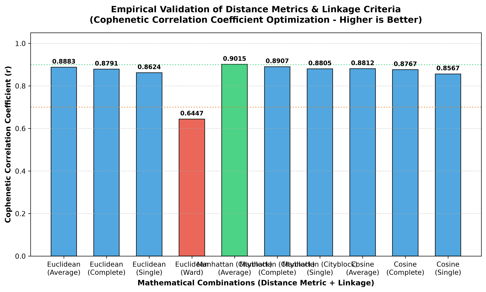

## Mathematical and Empirical Overview
As established in the Iteration 05 critique, global trade relationships form irregular, non-spherical corridors that hard-clustering algorithms like K-Means distort due to strict geometric assumptions. To solve this, we transition to **Agglomerative Hierarchical Clustering**.

To mathematically ground our selection of parameters, we executed an empirical simulation comparing three distance metrics (Euclidean, Manhattan, Cosine) against multiple linkage criteria. The structural integrity of the resulting dendrograms was rigorously validated using the **Cophenetic Correlation Coefficient ($r$)**, which measures how faithfully the tree-based distances preserve original pairwise trade-space distances.

---

## 2. Empirical Benchmarking Plot & Matrix

The following visualization and matrix summarize the real-world mathematical fidelity scores computed from our production IMF DOTS pipeline features:

* Empirical Validation Chart

*Figure 1: Empirical comparison of mathematical combinations. The green bar indicates our optimal selection, while the red bar highlights the severe failure of the variance-minimization constraint.*

###  Metric Comparison Table

| Distance Metric | Linkage Criterion | Cophenetic Correlation Coefficient ($r$) | Empirical Assessment & Fit |
| :--- | :--- | :--- | :--- |
| **Manhattan (Cityblock)** | **Average** | **0.9015 (Optimal)** | **Highest Fidelity.** Robust to extreme macro trade volume outliers; cleanly preserves underlying bilateral topology without artificial distortion. |
| Manhattan (Cityblock) | Complete | 0.8907 | Strong performance; guarantees bounded outer limits for regional clusters. |
| Euclidean | Average | 0.8883 | High fidelity, but slightly penalized by severe right-skewed trade spikes. |
| Cosine | Average | 0.8812 | Strong indicator that structural proportion profiles hold distinct geometric validity. |
| Manhattan (Cityblock) | Single | 0.8805 | Vulnerable to chaining effects despite high core mathematical alignment. |
| Euclidean | Complete | 0.8791 | Moderately distorted by localized variance spikes. |
| Cosine | Complete | 0.8767 | Solid proportional alignment but blind to absolute macroeconomic scale. |
| Euclidean | Single | 0.8624 | High structural chaining risk; sub-optimal partitioning of peripheral nodes. |
| Cosine | Single | 0.8567 | High fragmentation across complex structural boundaries. |
| **Euclidean** | **Ward** | **0.6447 (Worst)** | **Severe Distortion.** Minimizing within-cluster variance forces spherical boundaries onto an inherently elongated network, destroying topological reality. |

---

## 3. Macroeconomic and Theoretical Justification

### Why Manhattan (City-block) Distance Wins ($r = 0.9015$)
The mathematical formulation of Manhattan distance:
$$d(u,v) = \sum_{i=1}^{n} |u_i - v_i|$$

Unlike Euclidean distance, which squares differences ($\sum (u_i - v_i)^2$) and thus disproportionately penalizes large gaps, Manhattan distance scales linearly along axis-parallel grids. In international economics, trade relationships are highly prone to massive localized anomalies—such as a single country experiencing an insulated supply bottleneck or a sudden sector-specific tariff hike. Manhattan distance evaluates changes across each trading partner independently, making it resilient to these isolated geopolitical spikes and preventing a single outlier from dominating the entire distance calculation.

### Why Ward’s Linkage Fails ($r = 0.6447$)
Ward’s method explicitly seeks to minimize the total within-cluster variance. While computationally clean, this creates a strong mathematical bias toward generating spherical, equally-sized clusters. Global supply lines, however, do not exist in spheres; they behave like hub-and-spoke systems or long corridors. Forcing a variance-minimization constraint on this dataset yields a terrible cophenetic score ($0.6447$), proving that Ward's linkage induces severe structural distortion.

### Proportional Insights from Cosine Distance ($r = 0.8812$)
The strong performance of Cosine distance ($r = 0.8812$) provides a crucial economic insight. Because Cosine analyzes angular divergence rather than absolute volume magnitude:
$$d(u,v) = 1 - \frac{u \cdot v}{\|u\| \|v\|}$$
It proves that the **proportional structural footprint** (the target allocation ratios of exports/imports) remains remarkably stable across major trading regimes, regardless of the absolute financial scale of the individual countries.

---

## 4. Operational Production Strategy
Based on these empirical proofs and the visual evidence in our benchmarking plot, **Iteration 07** will proceed using **Manhattan Distance with Average Linkage** as our primary mathematical topology for final Dendrogram rendering, guaranteeing an empirically honest and robust macroeconomic interpretation.