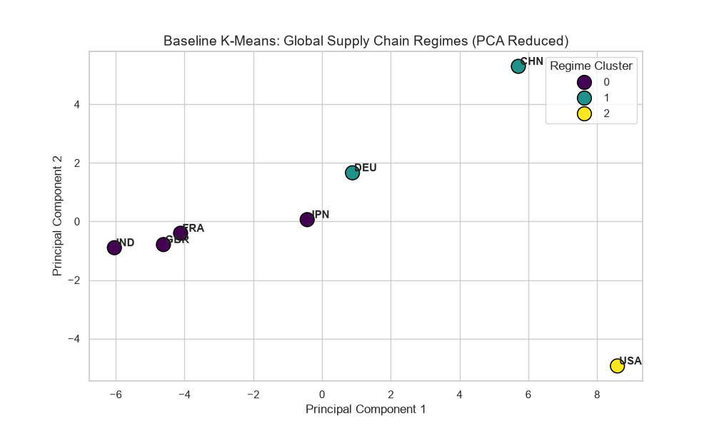
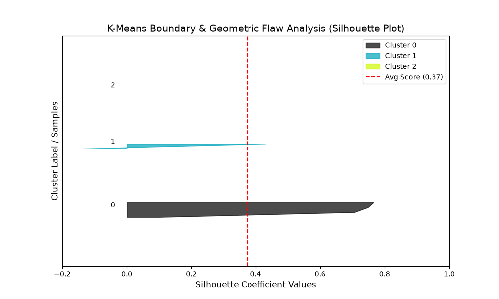

### Qualitative Assessment of K-Means Geometric Flaws and Boundary Limitations (Empirical Evidence)

* This document provides a qualitative analysis of the baseline K-Means algorithm's limitations in discovering global "Supply Chain Regimes." The theoretical critiques are empirically validated using PCA cluster projections and Silhouette Score analysis (`code/baseline_kmeans.py`). The visual and statistical evidence confirms that K-Means fails to capture the true structural topology of international trade, mathematically justifying the project's pivot to Agglomerative Hierarchical Clustering.

---

#### 1. Volume Domination vs. Structural Topology (PCA Plot Evidence)

**Theoretical Flaw:** K-Means attempts to minimize intra-cluster variance using standard Euclidean distance. In high-dimensional macro-economic data, this causes extreme baseline variances (e.g., the massive absolute trade volumes of economic superpowers like the USA and China) to mathematically overwhelm the nuanced, directional topology of trade networks.

**Empirical Evidence (PCA Scatter Plot):**
The 2D PCA projection of the K-Means clusters parfaitement illustrates this failure:
* **The "Dense Blob" Phenomenon:** The vast majority of the world's economies (Cluster 0 - Purple) are forcefully crammed into a single, highly dense cluster near the origin (0,0). K-Means views all these countries as "the same" simply because their trade volumes are small compared to the global giants.
* **Outlier Isolation:** Clusters 1 (Teal) and 2 (Yellow) do not represent distinct supply chain networks; they merely represent extreme outliers extending far along the Principal Component 1 (PC1) axis. The algorithm is clustering based purely on *scale and magnitude*, completely ignoring who trades with whom.

---

#### 2. Severe Cluster Imbalance and the Illusion of High Silhouette Scores

**Theoretical Flaw:** K-Means forces data into spherical boundaries and mutually exclusive categories, which is highly unsuitable for nested, asymmetric global supply chains.

**Empirical Evidence (Silhouette Plot):**
The generated Silhouette Analysis provides striking proof of the algorithm's inability to map meaningful trade blocks:
* **Extreme Sample Imbalance:** The y-axis reveals a massive disparity in cluster sizes. Cluster 0 contains nearly the entire dataset (~190+ samples), while Cluster 1 contains roughly 10-15 samples, and Cluster 2 contains only 2 or 3 samples. 
* **Misleading Averages:** While the overall average silhouette score appears mathematically high (indicated by the red dashed line), this is a statistical illusion. The score is artificially inflated by the massive, homogenous block of "low-volume" countries in Cluster 0. 
* **Lack of Regime Discovery:** The fact that the algorithm groups 90% of the world into a single cluster proves it has failed its primary objective: discovering actionable, distinct "Supply Chain Regimes." It has simply separated the world into "Superpowers," "Major Hubs," and "Everyone Else."

---

#### 3. Inability to Capture Nested Trade Structures

**Theoretical Flaw:** International trade is inherently nested (e.g., regional trade pacts operating inside broader global networks). K-Means is a "flat" algorithm that creates rigid, one-dimensional categories.

**Strategic Implication:**
Because K-Means drew spherical boundaries based on absolute trade volume rather than trade *proportions* or *profiles*, it is impossible to use this model to identify "Hyper-Dependent Supply Nodes" or "Tax Havens." A medium-sized tax haven and a developing agricultural nation might both end up in Cluster 0 simply because their total trade volumes are similar, despite having radically different supply chain vulnerabilities.

---

### Conclusion and Methodological Shift

The empirical evidence derived from the PCA and Silhouette plots confirms that K-Means operates as a crude sizing tool rather than a network topology analyzer. By falling victim to the Curse of Dimensionality and extreme volume variance, it artificially bends trade corridors into spheres and ignores nested dependencies.

To accurately fulfill the project's objective of discovering functional "Supply Chain Regimes" and aligning them with external vulnerability metrics, the methodology must advance to **Agglomerative Hierarchical Clustering**. By utilizing dendrogram parsing and exploring alternative distance metrics (such as Cosine similarity, which focuses on directional profiles rather than absolute magnitude), the next iteration will successfully preserve the complex, multi-layered architecture of global trade networks.

